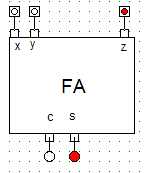

# Uke 2

## Introduksjon til Operativsystemer

Definisjon på et OS:

- A: Gi applikasjonsprogrammer og brukere enhetlig, enklere og mer abstrakt adgang til maskinens ressurser
- B: Administrere ressursene slik at prosesser og brukere ikke ødelegger for hverandre når de skal aksessere samme ressurser.

<p align="center">
    
    Prinsippskisse av Linux
</p>

Definisjon av prosess:
Alternative definisjoner:

1. Et program som kjører
2. Arbeidsoppgavene en prosessor gjør på et program
3. 1. Et kjørbart program
   2. Programmets data (variabler, filer, etc.)
   3. OS-kontekst (tilstand, prioritet, prosessor-registre, etc.)
4. Et programs ånd/sjel

   I en analogi hvor programmet som kjører er et menneskes DNA, vil prosessen være hele livet et menneske lever:

   **Program = DNA**<br>
   **Prosess = livet**<br>
   **Hardware = Organer/Universet/hus/mat/bygninger**<br>
   **OS = staten/lovverket**<br>
   **kill, Ctrl-C = drap**<br>
   **root/Administrator = Gud**
   **CPU = Hjerne**<br>
   **kriminalitet = Black hat hacking**

---

<br><br>

## Datamaskinarkitektur

### Logiske porter og Binær logikk

**AND:** Om begge signalene er 1, vil resultatet bli 1.<br>
**OR:** Om en eller begge signalene er 1, vil resultatet bli 1<br>
**NOT:** Signalet blir det motsatte.

<br>

AND:

| A   | B   | A $\cdot$ B |
| --- | --- | ----------- |
| 0   | 0   | 0           |
| 0   | 1   | 0           |
| 1   | 0   | 0           |
| 1   | 1   | 1           |

<p >
    
    <br>And Gate
</p>

<br>

OR:

| A   | B   | A + B |
| --- | --- | ----- |
| 0   | 0   | 0     |
| 0   | 1   | 1     |
| 1   | 0   | 1     |
| 1   | 1   | 1     |

<p>
    
    <br>OR Gate
</p>

<br>

NOT:

| A   | A not |
| --- | ----- |
| 0   | 1     |
| 1   | 0     |

<p>
    
    <br>NOT Gate
</p>

# Uke 3

## Transistorer, porter og krets som adderer tall

## Moore's Law

Moore's Lov sier at antall transistorer i integrerte kretser dobler seg annenhvert år.

## CMOS

**En teknologi for å lage kretser. Satt sammen av NMOS og PMOS**

## NMOS

**NMOS er en transistor. Ingen spenning inn, øvre og nedre del er isolert(bryter av)**

<p >
    
    <br>And Gate
</p>

## PMOS

**PMOS er en transistor. Virker motsatt av NMOS. Når det er spenning inn, er øvre og nedre del isolert(bryter er av)**

<p >
    
    <br>And Gate
</p>

**Man kan lage alle mulige logiske operasjoner bygget på transistorer ved å sette sammen systemer av NOT, AND og OR-porter.**

## Boolsk algebra

## I boolsk algebra uttrykkes AND, OR og NOT på følgende måte

- AND: A $\cdot$ B (A $\land$ B )<br>
- OR: A + B (A $\lor$ B)<br>
- NOT: $\overline{A}$ ($\lnot $ A )

### Eksempel på en logisk krets.

En krets hvor resultatet skal bli 1 når A og B er like.

$F(A,B) = A \cdot B + \overline {A}\cdot \overline {B} $. <br>

<p align="center">
    
    <br>Tegning av den logiske kretsen.
</p>

Sannhetstabell av den logiske kretsen over<br>
| A | B | A $\cdot$ B |
|---|---|-------|
| 0 | 0 | 1 |
| 1 | 0 | 0 |
| 0 | 1 | 0 |
| 1 | 1 | 1 |

## Forenkling av logiske uttrykk.

$\displaystyle F(A,B) = \overline{A}\cdot B + A \cdot B = ( \overline{A} + A) \cdot B = 1 \cdot B = B
$

Her har vi brukt at at $\overline{A} + A = 1$ som gjelder kun for Boolsk algebre.

| A   | B   | F (A,B) |
| --- | --- | ------- |
| 0   | 0   | 0       |
| 0   | 1   | 1       |
| 1   | 0   | 0       |
| 1   | 1   | 1       |

## Hvordan kan man få en logisk krets til å addere?

<p align="center">
    
    <br>Full Adder.
</p>

<p align="center">
    
    <br>Full Adder krets.
</p>

//TODO

---

# Uke 4

## Vipper og registre, CPU-arkitektur.

## ALU: Arithmetic Logic Unit

ALU er den delen av en CPU som utfører artimetiske operasjoner:

- Adder
- Inkrement (++)
- Dekrement ($- -$)
- Multipliser
- Divider
- Shift (flytt alle bit i en retning)
- Sammenligne
- AND, OR, NOT, XOR

### Kontrollbits

Hvilken operasjon ALU'en skal utføre kontrolleres ved bruk av kontroll-bits som gis forskjellige verdier.

## Vipper og registre

Vipper er den grunnleggende lagringsenheten i CPU og bruker til lagring i CPU'en sin cache samt cache mellom CPU og RAM.

For å lage en lagerplass som hurtig kan leses å endres må vi bruke logiske porter. Av slike porter kan man lage en lagerenhet som kan lagre nuller og enere og disse kalles vipper.

## D-lås (D-latch)

En D-lås er en lagringskrets som brukes for å lagre én bit. I bildet under er det verdien D sender inn i kretsen som er verdien som lagres, og C brukes som en lås/kontroll-signal. Når C = 1 vil den nye verdien lagres. Om C = 0 vil verdien i kretsen forbli som den er.

<p align="center">
    
    <br>En D-lås som lagrer én bit.
</p>

## Shift-register

For å kunne kontrollere flyten av data, og forsikre seg om at alle d-låsene leser og sender til riktig tid, kan man bruke en klokke som går på ca 1-3GHz. Denne klokken sender signaler med et kort mellomrom, og verdiene vil kun oppdatere seg når de mottar et slikt signal.

<p align="center">
    
    <br>D-vippe av 4 D-låser.
</p>

# CPU-arkitektur

<p align="center">
    
    <br>CPU Arkitektur
</p>

# Von Neumann -arkitekturen

Den vanligste CPU-arkitekturen som brukes i dag er von Neumann arkitekturen. En negativ ting med denne arkitekturen, kjent som "the von Neumann bottleneck", er at både instruksjoner og data deler samme data-buss.

# Harvard arkitekturen

Harvard-arkitekturen har løst dette problemet med å ha to fysisk separerte data-busser. De som bruker Harvard-arkitekturen bruker også ofte en modifisert hardvard-arkitektur.

- Et arbeidsminne (internminnet/RAM) som inneholder både instruksjoner og kode.
- En aritmetisk/logisk enhet (ALU - Arithmetic Logic Unit) som kan utføre matematiske og logiske operasjoner.
- En kontrollenhet som henter inn instruksjoner fra RAM, dekoder dem og sender signaler som gjør at instruksjonen blir utført.
- Registre, internlager for både instruksjoner og data inne i CPU-en.
- Enheter for input og output som gjør at CPU kan kommunisere med harddisk, tastatur, nettverk, etc.

## Beregningsenheter

- ALU (Arithmetic Logic Unit) CPU-ens hjerne
- CPU (Central Processing Unit)
- FPU (Floating-Point Unit) vanligvis integrert i CPU
- GPU (Graphics Processing Unit) tusenvis av cores
- FPGA (Field-programmable Gate Array) programmerbar logikk
- ASIC (Application-Specific Integrated Circuit)

## Fra høynivåkode til CPU-beregning

All høynivå-kode oversettes til maskinkode av en kompilator eller liknende.

## Branch control

Branch control tillater en CPU å utføre instruksjoner som if, for og while.

# Uke5

## C, maskinkode og assembly

https://www.eecg.utoronto.ca/~amza/www.mindsec.com/files/x86regs.html

// TODO

# Uke 6

## Pipelining

Det er vanlig å dele opp instruksjoner i flere steg (stages), der en instruksjon kan begynne på sitt første steg så snart den forrige instruksjonen er ferdig med det steget. De kan altså kjøre samtidig, med bare ett stegs mellomrom.

# Uke 7

## Branch prediction, Multitasking

## Branch prediction

Med branch prediction er målet å gjette hva som er neste branch. Om man gjetter riktig kan man spare tid, men det må også gjøres om hvis man gjettet feil.

Branch prediction er et stort problem for piplining, må vente på resultat fra forrige instruksjon.

## Meltdown

Sikkerhetshull i hardware funnet i 2018. Meltdown utnytter at både koden som sjekker om prosessen kan lese fra RAM og lesingen fra RAM delvis utføres. Meltdown kan da lese data fra andre prosesser som er cachet med enda ikke fjernet pga feil branch.

### Interrupts

Et interrupt er et signal fra hardware. Når CPU'en får en interrupt vil den avbryte det den gjør for å håndtere signalet. Adressen til neste instruksjon blir lagret på stack så den kan fortsette etter interrupt-signalet er behandlet. Det finnes flere forskjellige interrupt-signaler med sine egne rutiner. De har forskjellige interrupt-nr (IRQ).

## Singletasking OS

Basis for flerprosess-systemer.

<p align="center">
    
    <br>Internminnekart for singeltasking
</p>

## Multitasking OS

**_For å lage et system som kan kjøre n programmer samtidig, må vi få en enprosess maskin til å se ut som n maskiner._**

**_Bruker software til å fordele tid mellom n programmer og å dele ressurser; minne, disk, skjerm etc. OS-kjernen utfører denne oppgaven._**

Samtidige prosesser må tildeles hver sin del av minne:

<p align="center">
    
    <br>Internminnekart for multitasking
</p>

## Multitasking

Får det til å se ut som at flere prosesser kjøres samtidig men i prinsippet er det en og en prosess som får litt cpu tid hver. Alle prosessene legges i et køsystem kalt Round Robin. En hardware timer slås inn hvert hundre dels sekund og lagrer alt fra prosessen som kjøres og bytter til neste prosess i listen. Dette bytte kalles context switch.

## PCB - Process control block

- CPU registre
- pekere til stack
- prosesstilstand (sleep, run, ready, wait, new, stopped)
- navn (PID)
- eier (bruker)
- prioritet (styrer hvor mye CPU-tid den får)
- parent prosess
- ressurser (åpne filer, etc.)

## Timesharing og Context Switch

CPU-scheduling = å fordele CPU-tid mellom prosessene = Time Sharing

OS sender interrupt = CPU lagrer alt fra prosessen som kjører = OS lar neste prosess i Round Robin få CPU tid = Context Switch

# Uke 9

## Multitasking, cache, hyperthreading

Hvorfor er ikke Real = User + System for time-kommandoen?

Hvis cpu usage er 100% så vil User + System = Real.3GHz

User = Usermode
System = Kernelmode.

Regen ut CPU tid - Hvis en prosess tar 15 sekunder på en cpu. Hvor mange sekunder vil det ta hvis man kjører 5 sånne prosesser på en maskin med 4 cores(CPU`er)???

Når en prosess tar 10 sekunder, vil det kreves 5x10 = 50 CPU-sekunder for å fullføre alle de fem jobbene. Arbeidsmengden blir fordelt likt på fire CPUer og det vil da ta 50/4 = 12.5 sekunder å fullføre hver jobb. Og dette resultatet får man om man kjører fem jobber samtidig.

15 \* 5 / 4 = 18,75

## Hva er forskjellen på disse to kjøringene?

for i in {1..5}; do time ./regn& done
for i in {1..5}; do time ./regn done

Første loop starter regn programmet i bakgrunnen. Her vil alle starte samtidig.

Andre loop, her vil man måtte vente til første regn programmet er ferdig før neste starter.

## Internminnet og Cache

RAM - en forkortelse for Random Access Memory.'Random' fordi hvilken som helst byte kan leses ut eller aksesseres like raskt som enhver annen byte.

RAM er laget av DRAM(Dynamic RAM), Må opplades 10 ganger i sekundet. Består av en transisto og en kapasitator(Lagrer elektrisk ladning) for å lagre en bit.

## Cache

Instruksjonene til CPU'en ligger lagret på internminnet (RAM) og hentes til cache når de trengs. Å ha instruksjonene du trenger liggende på CPU sin cache er en fordel da det kan ta 10 ganger så lang tid å hente data fra RAM som fra cache.

## 7.4 Multitasking og Multiprocessing

- Multitasking/Multiprogramming Software(OS) brukes til å fordele tid fra samme CPU mellom flere prosesser
- Multiprocessing To eller flere CPU'er i samme computersystem kjører flere prosesser virkelig samtidig, på samme tidspunkt
- Symmetric Multiprocessing SMP, to eller flere prosessorer deler samme internminnet og kjører flere prosesser virkelig samtidig, på samme tidspunkt
- Multi Core Multiprocessing To eller flere prosessorer på samme brikke deler cache og databus og kjører flere prosesser samtidig. Regnes også som SMP.

## 7.7 Hyperthreading

Det vil si at deler av CPU-en er duplisert, som alle registerne, men for eksempel ikke ALU-en. En CPU kan da innholde to prosesser samtidig, slik at hvis den ene prosessen for eksempel bruker tid på å hente noe fra minne, kan CPUen ekstremt raskt switche over og la den andre prosessen bruke ALU-en

## Kjører en CPU med hyperthreading to prosesser reelt sett samtidig?

8 regne jobber kjørt på en cpu med 8 hyperthreading cores(4 fysiske cores) kan se ut som at alle får 100% cpu men hvis man ser på tiden så vil dette bruke dobbelt så lang tid i motsetning til hvis man kjører 4 jobber på samme cpu.

Eksempler under:

```bash
rex:~/regn$ for i in {1..4}; do time ./regn & done

Real:18.152 User:18.144 System:0.000 99.96%
Real:18.401 User:18.392 System:0.004 99.97%
Real:18.417 User:18.412 System:0.000 99.97%
Real:18.516 User:18.508 System:0.000 99.96%
```

```bash
rex:~/regn$ for i in {1..8}; do time ./regn & done
Real:35.048 User:35.008 System:0.000 99.88%
Real:35.222 User:35.144 System:0.000 99.78%
Real:35.246 User:35.104 System:0.000 99.59%
Real:35.270 User:34.976 System:0.020 99.22%
Real:35.500 User:34.888 System:0.008 98.29%
Real:35.562 User:34.840 System:0.012 98.00%
Real:35.606 User:35.448 System:0.000 99.55%
Real:35.796 User:35.140 System:0.012 98.20%
```

## Hyperthreading med prosess som bruker mye RAM

Om prosessene skriver mye til RAM, i motsetning til ALU, vil hyperthreading være ekstremt effektivt. Det tar tid å hente fra RAM og mens en prosess bruker tid på å hente data kan en annen utføre arbeid. Om man har 4 kjerner med 8 tråder vil det ikke være mer enn et par prosent forskjell i kjøretid med 4 eller 8 prosesser.

Med hyperthreading er det gjerne hardware som switcher mellom prosesser, i stedet for OS. Det er fordi det trengs å gjøre raske bytter mens en prosess henter noe data fra RAM, og om OS skulle gjort dette kan det ta 10 ganger så lang tid.

## Taskset

    time taskset -c 0  ./regn

Med kommandoen taskset -c kan man tvinge jobber til å kjøre på samme cpu.

flere alternative kjøringer under

    for i in 1 2; do time taskset -c 0  ./regn& done

    for cpu in 0 4; do time taskset -c $cpu  ./regn& done

# Uke 10

# Systemkall, Scheduling og vaffelrøre

## 8.3 Hvorfor kan ikke en prosess bruke to CPU-er?

Et program klarer bare å utnytte en prosessor om gangen, så den kan ikke bruke alle 4 i en 4-kjerners prosessor f.eks.
Men om programmet er skrevet med parallellisert kode, kan det kjøre på flere prosessorer samtidig.
Dvs. at maskinen ikke selv kan kjøre et program i parallell, det er opp til programmeren å designe programmet sitt slik.

## Samtidige prosesser

For at prosesser ikke skal kunne overskrive eksisterende minne og/eller få CPU til å henge har OS total kontroll. Dette kalles "Preemptive multitasking"

## Prosessor modus

I moderne prosessorer switcher CPU mellom brukermodus og priviligert modus ved hjelp av en modusbit. Omtrent hver hundrende sekund vil OS ta over CPU'en og tildele prosessene en ny mengde CPU-tid.

## Systemkall/Trap

OS må igjen ha hjelp fra hardware i form av en spesiell instruksjon, trap, som i samme operasjon switcher modussbit til kernel og hopper til ett av flere predefinert steder i minnet hvor det ligger kode for systemkall, som vist i figur 56. Det er da ikke mulig å switche til kernelmodus og kjøre vilkårlig kode etterpå for vanlige brukerprogrammer. Etter systemkallet er utført, switcher OS modusbit til brukermodus og returnerer til der i koden systemkallet ble utført.

## Prioritet i Linux-scheduling

- Tiden deles i epoker
- Hver prosess tildeles et time-quantum målt i et helt antall jiffies som legges i variabelen counter. F. eks. 20 i enheter av ticks = 10 ms = timer-intervall
- OS kjører Round Robin-scheduling. Prosessen som kjører mister ett tick (counter reduseres med en) for hvert timer-tick.
- For hvert timer-tick sjekkes det om kjørende prosess har flere ticks, counter > 0
- Hvis counter > 0 fortsetter prosessen, hvis ikke kalles schedule() som velger en ny
- Epoken er over når alle prosesser har brukt opp sin tid (counter = 0)
- Antall ticks som deles ut før hver epoke bestemmes av prioriteten og lagres i en variabel med navn 'priority'
- En vanlig brukerprosess kan senke sin egen prioritet
- Prioritet kan dermed endres dynamisk (har en prosess brukt mye CPU, kan den f. eks. få nedsatt prioritet)
- Gjennomsnittlig time-quantum for 2.4 kjernen var ca 210 ms
- Gjennomsnittlig time-quantum for 2.6 kjernen var ca 100 ms

## need_resched

Mens en prosess fullfører egne tildelte ticks og det hvis det kommer et interrupt, f eks et tastetrykk fra tastatur vil et flagg need_resched bli satt og scheduler på grunn av dette kjøres etter neste timer-tick. En interaktiv prosess vil få mange ticks hver epoke og komme i en høy prioritetsklasse.3GHz

# Uke11

# Prosesser, OS-arkitektur

## Systemkall og timer ticks

## Prioritet

<p align="center">
    
    <br>Prioritet
</p>

## Scheduling-algoritmer

Scheduling (skedulering) betegner organiseringen av hvordan man tildeler ressurser til en arbeidsoppgave som skal gjennomføres. I mange sammenhenger trenger man algoritmer som sørger for at en arbeidsoppgave blir effektivt fullført og som fordeler tid eller andre ressurser, organiserer jobbflyt og hvordan prosesser utføres og det trenger ikke nødvendigvis å være prosesser i en datamaskin. Noen vanlige algoritmer er:

- RR (Round Robin) Prosesser kjører på omgang, litt tid hver runde
- FCFS (First Come First Served) Den første prosessen blir først prosessert
- FIFO (First In Firs Out) Samme som FCFS
- SJF (Shortest Job First) Den prosessen som tar kortest tid er den neste som kjøres

## Nice

- nice $\longrightarrow$ vær snill med andre prosesser
- Høyere niceverdi gir mindre CPU-tid til prosessen
- default niceverdi er 0
- top viser niceverdier

## Prosessforløp

Denne figuren viser de viktigste tilstandene i et prosessforløp. Prosesser som ligger i ready-list ønsker så snart som mulig å bli tildelt tid i prosessoren og dermed komme over i tilstand running. Prosesser som venter av fri vilje eller som for eksempel må vente på Input/Output (I/O) settes i waiting-tilsta[](https://nexus.cs.hioa.no/~haugerud/os/Forelesning/os/node10.html)nd.

<p align="center">
    
    <br>Prosessforløp
</p>

## Sentrale schedulingbegreper

- Enqueuer
  - Legger i kø
  - Beregner prioritet
- Dispatcher
  - Velger prosess fra READY LIST; liste med prosesser som er klare til å kjøre

## Lage ny prosess

Prosesser lages ved

- System oppstart (Linux: init-prosessen)
- En kjørende prosess utfører et systemkall som staret en ny prosess
- En bruker ber om at en prosess startes

## Avslutte prosesser

Vanligvis avsluttes prosesser når jobben er ferdig. Noen prosesser, såkalte daemons, kjører hele tiden mens systemet er oppe. Prosesser avsluttes ved:

- Normal avslutning. Frivillig. Linux: exit, Windows: ExitProcess
- Avslutning ved feil. Frivillig. (f. eks. 'file not found')
- Fatal feil. Ufrivillig. (division by zero, Segmentation fault, core dumped)
- Drept av annen prosess. Ufrivillig. Linux: kill, Windows: TerminateProcess

## Linux fork()

Er et Linux Systemkall for å lage en child-prosess. Det lages en kloning av en prosess. Kopi av program, data og PCB(Process Controll bank) bortsett fra PID, PPID og noen andre.
